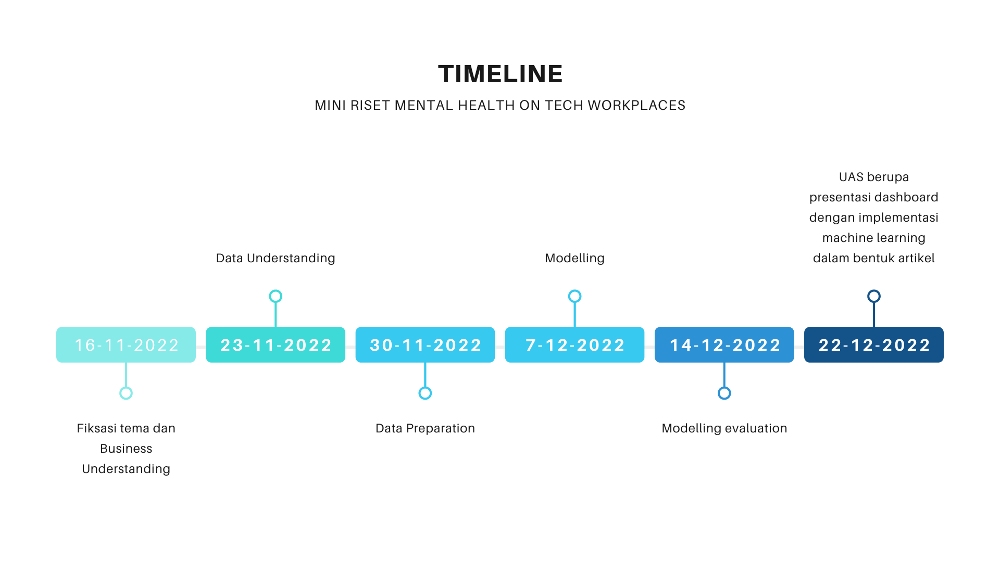

# Mental Health on Tech Workplaces

# Our Team

 

    

# Business Understanding

## Latar Belakang Masalah
Kesehatan merupakan salah satu komponen penting yang harus diperhatikan oleh manusia. Kesehatan memiliki beberapa jenis yaitu kesehatan fisik, mental, sosial dan ekonomi. Kesehatan mental sendiri mempunyai arti keadaan dimana seseorang dapat menyadari potensi yang dimilikinya, bekerja secara produktif, mampu mengatasi tekanan hidup, dan dapat memberikan kontribusi bagi sekitarnya secara maksimal. Sehingga kesehatan mental mencangkup pada aspek-aspek kesehatan fisik, sosial dan ekonomi.

Sekarang kita tahu bahwa kesehatan mental sangat berperan penting dalam kehidupan manusia. Namun, tidak sedikit orang yang masih belum aware dengan kesehatan mental hanya memikirkan kesehatan fisik dan ekonomi saja. Padahal jika salah satu terganggu maka secara tidak sadar akan mempengaruhi kesehatan yang lain. Selain itu kesehatan mental harus diperhatikan oleh seluruh manusia karna dampak nya dapat terjadi kepada seluruh kalangan, baik anak sekolah, pekerja, bahkan orang yang sudah berumah tangga.

Pada perusahaan teknologi para pekerja dituntut untuk menciptakan inovasi terbaru tiap tahunnya. karena hal ini pula banyak dari para pekerja yang mengorbankan kesehatan mereka entah itu kesehatan mental dan kesehatan fisik. Kesehatan mental pada kalangan pekerja khususnya dibidang teknologi sangat perlu diperhatikan namun kenyataannya kesehatan mental sering luput diperhatikan oleh perusahaan dan pekerja itu sendiri karena masih menyepelekan dan menganggap faktor penyebab kesehatan mental, seperti jam kerja yang tidak teratur, beban kerja yang berat, lingkungan kerja yang tidak sehat dan lain sebagainya, merupakan hal yang wajar terjadi dilingkungan kerja, padahal itu dapat menjadi pemicu seorang pekerja menjadi tidak produktif, burnout, dan kurang maksimal.
## Identifikasi Masalah
1. Tingginya para pekerja bidang teknologi di United states dengan kondisi kesehatan mental yang kurang diperhatikan
2. Beratnya beban pekerjaan di bidang teknologi yang mampu membuat kesehatan mental menurun
3. Kesehatan mental berpengaruh pada pentingnya produktivitas kerja
4. Kesehatan mental yang buruk membuat pekerjaan yang dilakukan tidak maksimal
5. Gangguan kesehatan mental pekerja berpotensi membawa dampak pada kerugian perekonomian

## Metode Pendekatan Penyelesaian Masalah
Metode penyelesaian masalah yang digunakan pada penelitian ini adalah metodologi CRISP-DM. Metodologi Cross-Industry Standard Process for Data Mining atau CRISP-DM adalah salah satu model proses datamining (datamining framework) yang awalnya (1996) dibangun oleh 5 perusahaan yaitu Integral Solutions Ltd (ISL), Teradata, Daimler AG, NCR Corporation dan OHRA. Framework ini kemudian dikembangan oleh ratusan organisasi dan perusahaan di Eropa untuk dijadikan methodology standard non-proprietary bagi data mining. Versi pertama dari methodologi ini dipresentasikan pada 4th CRISP-DM SIG Workshop di Brussels pada bulan Maret 1999 (Pete Chapman, 1999); dan langkah langkah proses datamining berdasarkan model ini di publikasikan pada tahun berikutnya (Pete Chapman,2000).
Banyak hasil penelitian yang mengungkapkan bahwa CRISP-DM adalah datamining model yang masih digunakan secara luas di kalangan industry, sebahagian dikarenakan keunggulannya dalam menyelesaikan banyak persoalan dalam proyek proyek data mining.CRISP-DM memiliki 6 tahapan yaitu:
1. Business Understanding
2. Data Understanding
3. Data Preparation
4. Modeling
5. Evaluation
6. Deployment

## Tujuan Teknis dan Kriteria Kesuksesan
1. Mengetahui gender para pekerja di bidang teknologi di United States yang lebih dominan mengalami gangguan mental 
2. Mengetahui berapa lama waktu kerja yang dilakukan oleh para pekerja di bidang teknologi di United States yang menderita gangguan mental
3. Mengetahui faktor apa yang paling berpengaruh pada kesehatan mental para pekerja di bidang teknologi di United States
4. Mengetahui apakah para pekerja di bidang teknologi di United States ini sudah mendapatkan terapi pengobatan
5. Mengetahui rentang usia para pekerja di bidang teknologi di United States yang rentan mengalami gangguan mental

## Timeline mini riset
Timeline mini riset tentang mental health on tech workspace mengikuti tahapan dari metode CRISP-DM. Berikut adalah timeline dari mini riset ini.
1. Pencarian topik penelitian
2. Pencarian dataset yang cocok dengan topik penelitian
3. Pemilihan algoritma
4. Business Understanding
5. Data Understanding
6. Data Preparation
7. Modeling
8. Evaluation

# Data Understanding

## Kebutuhan Data
Kebutuhan data yang diperlukan dalam penelitian ini adalah kondisi mental dari para pekerja yang bekerja di bidang teknologi serta faktor apa saja yang mempengaruhi kesehatan mental para pekerja tersebut.

## Pengambilan Data
Pengambilan data dilakukan melalui dari website dataset, yaitu kaggle dengan judul dataset Mental Health in Tech Survey yang beralamatkan di https://www.kaggle.com/datasets/osmi/mental-health-in-tech-survey

## Integrasi Data
Data yang digunakan dalam penelitian ini merupakan data yang berasal hanya dari satu sumber data saja. Integrasi data yang dilakukan dalam penelitian ini nantinya hanya akan menghubungkan antar jenis data sesuai dengan kebutuhan data yang diperlukan.

## Telaah Karekteristik Data

## Validasi Data

# Data Preparation

# Modelling

# Modelling Evaluation

# Dashboard

