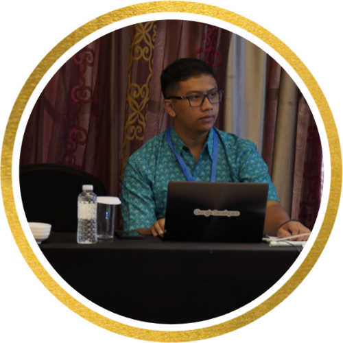
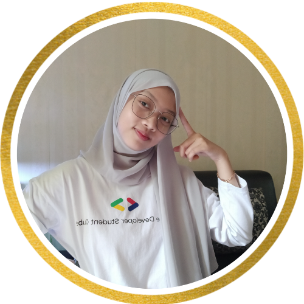
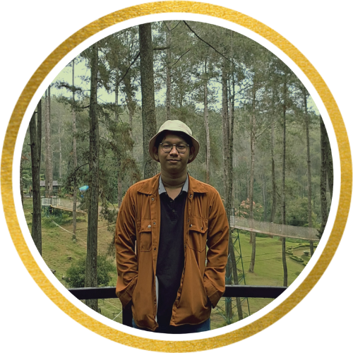

# Mental Health on Tech Workplaces

# Our Team

 

    

# Business Understanding

## Latar Belakang Masalah
## Identifikasi Masalah
## Metode Pendekatan Penyelesaian Masalah
## Tujuan Teknis dan Kriteria Kesuksesan
## Time line mini riset

# Data Understanding

# Data Preparation

# Modelling

# Modelling Evaluation

# Dashboard

